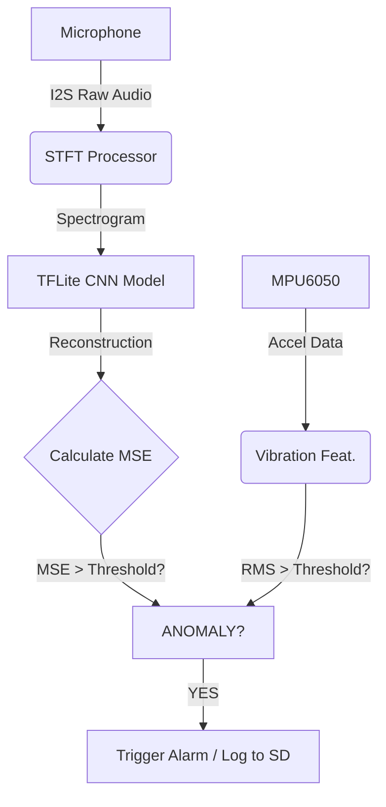

# Predictive Maintenance with TinyML on ESP32

A self-calibrating, unsupervised anomaly detection system for rotating machinery. This project uses a lightweight **Convolutional Autoencoder (CNN)** running entirely on an ESP32 microcontroller to detect potential faults (bearings, unbalance, misalignment) by analyzing audio and vibration patterns.

## 🚀 Key Features

*   **Unsupervised Learning:** No need to collect "faulty" data for training. The model learns what "normal" looks like and flags anything different.
*   **Dual-Sensor Fusion:** Combines audio (I2S Microphone) and vibration (MPU6050 Accelerometer) data.
*   **Temperature Monitoring:** Logs ambient machine temperature using the MPU6050's internal sensor.
*   **Edge AI:** Full inference runs on-device using **TensorFlow Lite for Microcontrollers**.
*   **Self-Calibration:** Automatically learns the baseline noise/vibration floor of the specific machine it is attached to.
*   **Privacy & Offline:** No cloud dependency. All processing happens locally.
*   **Black Box Logging:** Records anomaly events to an SD card for post-mortem analysis.

## 🛠️ Hardware Requirements

*   **Microcontroller:** ESP32 DevKit (or compatible)
*   **Audio Sensor:** INMP441 I2S Omnidirectional Microphone
*   **Vibration Sensor:** MPU6050 Accelerometer/Gyroscope
*   **Storage (Optional):** MicroSD Card Module (SPI)
*   **Indicator:** Built-in LED or external LED

### Pin Configuration

| Component | Pin Name | ESP32 GPIO |
| :--- | :--- | :--- |
| **INMP441** | SCK (BCLK) | 33 |
| | WS (LRCLK) | 25 |
| | SD (SDIN) | 32 |
| **MPU6050** | SDA | 21 |
| | SCL | 22 |
| **SD Card** | CS | 5 |
| | MOSI | 23 |
| | CLK | 18 |
| | MISO | 19 |
| **Misc** | LED | 2 |
| | Calibrate Button | 0 (BOOT) |

### ⚡ Important Wiring Notes
*   **SD Card Stability:** The SD card can draw high peak currents. Place a **10µF - 100µF capacitor** between the SD Card's **VCC and GND** pins, as close to the card reader as possible.
*   **ESP32 Power:** To prevent brownouts during high CPU usage (AI inference), place a **10µF - 100µF capacitor** across the ESP32's **3.3V/5V and GND** rails.

## 🧠 Software Architecture

### 1. Data Pipeline & Training (`pipeline/`)
*   **`pipeline/model/`**: Contains the Autoencoder model (`autoencoder_model.py`), `train_esp32_matched.py`, and training scripts.
*   **`pipeline/gui/`**: The Ground Control Station (`ground_control_station.py`) for real-time visualization.
*   **`pipeline/utils/`**: Helper scripts like `dsp_pipeline.py`.

### 2. ESP32 Firmware (`main/`)
*   **Core Logic:**
    *   **Dual-Core Execution:**
        *   **Core 0:** System tasks, logging, Wi-Fi (if enabled).
        *   **Core 1:** High-priority DSP and AI inference loop (`anomalyDetectionTask`).
*   **DSP Pipeline (`stft_processor.hpp`):** Converts raw audio into spectrograms for the neural network.
*   **Inference (`tflite_inference.hpp`):** Wraps the TensorFlow Lite Micro interpreter to run the quantized CNN model.
*   **Drivers & Utilities:**
    *   **`i2s_microphone.hpp`:** Handles I2S DMA communication to read high-quality audio from the INMP441.
    *   **`mpu6050_watchdog.hpp`:** Manages I2C communication with the accelerometer, providing vibration data and **temperature readings**.
    *   **`sd_card_logger.hpp`:** Implements a localized "Black Box" to save CSV logs of anomaly events to an SD card.
    *   **`deep_sleep_manager.hpp`:** Optimizes power consumption by putting the ESP32 into deep sleep when the machine is idle.
*   **Calibration (`anomaly_detector.cpp`):**
    *   Runs for ~90 seconds on first startup.
    *   Saves baseline stats to **NVS Flash**.
    *   Calculates dynamic thresholds for both Audio MSE (Mean Squared Error) and Vibration RMS.

## 📦 Installation & Usage

### Step 1: Train the Model (Optional)
*   The project comes with a pre-trained model. If you want to retrain:
    1.  Install dependencies: `pip install -r pipeline/requirements.txt`
    2.  Collect normal sound samples (wav files) in a folder.
    3.  Run training: `python pipeline/model/train_esp32_matched.py`
    4.  Copy the generated `model_data.h` to `main/model/`.

### Step 2: Flash the ESP32
1.  Install **ESP-IDF** (v5.x recommended).
2.  Navigate to the project root.
3.  Build and flash:
    ```bash
    idf.py build flash monitor
    ```

### Step 3: Run & Calibrate
1.  Mount the device on your machine (motor, fan, pump, etc.).
2.  Power on. The system will detect no calibration exists and enter **Calibration Mode** (LED blinks fast).
3.  Let the machine run normally for ~90 seconds.
4.  Once complete, the LED will stay solid for 2 seconds.
5.  **Monitoring is active.**
    *   **Red (Log):** Normal operation.
    *   **Blue (LED & Log):** Anomaly detected!

### Step 4: Recalibration
*   If you move the device to a new machine, press and hold the **BOOT button (GPIO 0)** for **3 seconds** to wipe settings and restart calibration.

## 📊 Visualizing Code Flow




